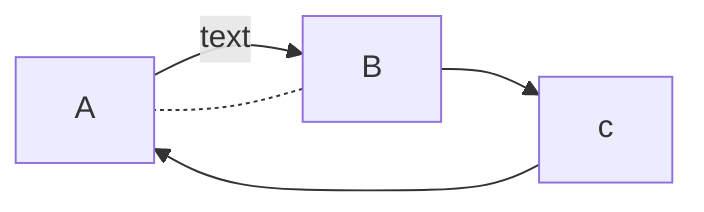
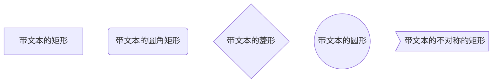
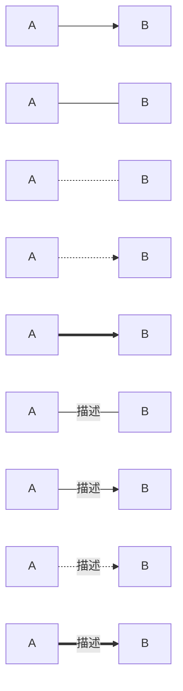
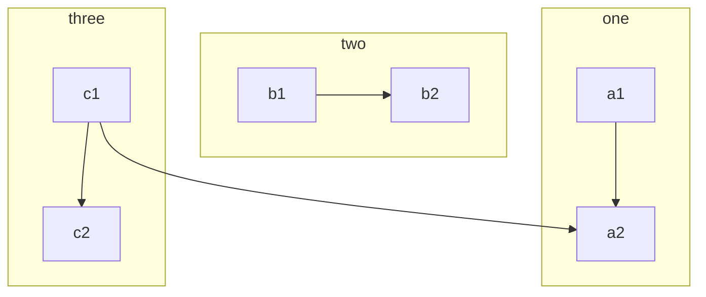
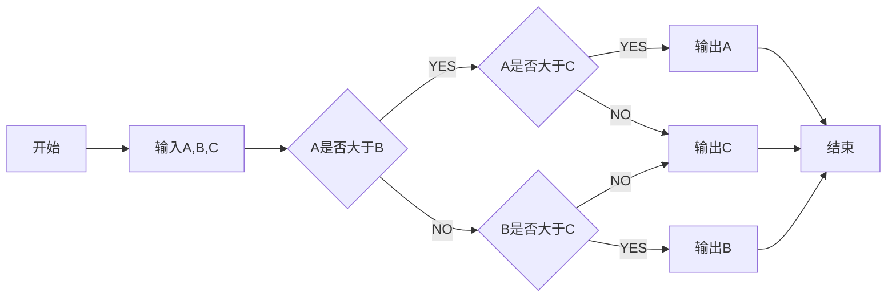

要想学会设计模式还是得先学会UML

要想学会UML就先看看其中类之间的六种关系吧

https://design-patterns.readthedocs.io/zh_CN/latest/read_uml.html

generalization泛化关系 空心实箭头

is-a关系 属于继承和泛化

realize实现关系 空心箭头虚线

aggregation聚合关系	空心菱形  整体和部分不是强依赖的，整体不存在了部分依然存在

composition组合关系	实心菱形 整体和部分是强以来的，整体不存在部分也不会存在

association关联关系	一条直线	关联关系默认不强调方向

dependency依赖关系	---> 表示A依赖于B；他描述一个对象在运行期间会用到另一个对象的关系

----------------

附mermaid语法



```
​```mermaid
	graph 流程图方向(TB上到下/BT下到上/RL右到左/LR左到右/TD同TB)
	流程图内容
​```
```







